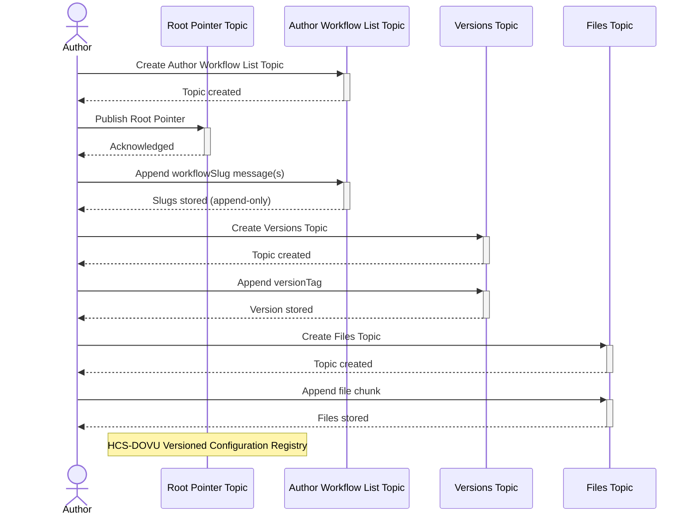

# Blueprint Registry — HCS Topics and Message Structure

__Probably needs updating here__

This document defines the **Hedera Consensus Service (HCS)** topics and message envelopes used for the **Blueprint Registry**.

Each topic represents a verifiable, append-only log that encodes either:
- ownership and registration data (author-level)
- version metadata (workflow-level)
- file integrity (version-level)

All topics share the same fundamental properties:
- **Linear ordering:** enforced by HCS consensus timestamps.
- **Append-only:** once submitted, no messages are altered or deleted.
- **Causally safe:** messages for a given blueprint instance flow in strict order.

All submission require linear queuing to maintain order of operations. 

## 1. Topic Overview

| Topic Type | Purpose | Created By | Example Reference |
|-------------|----------|-------------|-------------------|
| **Root Pointer** | Binds an author’s public key to their registry root. | DOVU OS / Author | `rootTopicId` |
| **Author Workflow List** | Lists all blueprints (slugs) owned by that author. | Author | `workflowListTopicId` |
| **Blueprint Versions** | Tracks published versions of a specific blueprint. | Author | `versionsTopicId` |
| **Files Topic** | Anchors file hashes, manifests, and chunks. | Author or automated publisher | `filesTopicId` |

Example diagram




## 2. Root Pointer Message 

Represents an author’s registry entry point. This relates to an already present author topic ID (txId), and it basically enables an author to be publicly searchable.

The signature and algorithms are in place to ensure that only a single txID can be referenced within the root pointer, as the txId acts as a unique initialisation vector. 

```json
{
  "slug": "dovu-labs",
  "authorTopicId": "0.0.890321",
  "ownerPubKey": "ed25519:ab23...xyz",
  "txId": "0.0.0.0.1@123456.123456",
  "sig": "signature of sha256(authorTopicId)",
  "alg": "[optional] default ED25519"
}
```

## 3. Author Workflow List Topic

The Author Workflow List Topic belongs to a single author and serves one job: enumerate every distinct workflow they publish and point to the topic that holds that workflow’s version history.

### Parent-child chain

1. Root Pointer Topic  (slug → authorId)  
2. Author Workflow List Topic (workflow → versionId)   
3. Versions Topic (v1, v1.1…)
4. Files Topic (chunk@1)

### Purpose

- Provide a discoverable list of workflow slugs (wagyu-supply, asset-audit, …) owned by this author.
- Link each slug to its dedicated Versions Topic (versionsTopicId) where immutable version pointers live.
- Remain append-only; no edits or deletions—new slugs are simply appended.


```json
{
  "t": "workflow-register@1",
  "slug": "wagyu-supply",
  "versionsTopicId": "0.0.890321",
  "title": "Wagyu Cattle Provenance",
  "tags": "[optional] livestock, traceability"
}
```


## 4. Immutable list of released versions

Every workflow registered by an author gets exactly one “versions topic” per workflow slug.

That topic is append-only and gated by the same submit-key as its parent list topic; it enumerates each released version and points to the corresponding files topic that holds the artefacts.

```json
{
  "t": "workflow-version-create@1",
  "filesTopicId": "0.0.890321",
  "tags": "v1.0.0"
}
```


## 5. Files Topic — step 4: HCS-1 stream of the actual artefacts

**TODO:** We might temporarily point to a IPFS CID 

Each filesTopicId referenced in a workflow-version-register@1 message is a dedicated HCS topic that contains nothing but file chunks for one specific workflow version.

The final step4 filesTopicId relates to a HCS-1 file topic of many files that make up a configuration.

We want an actual file store/reference of all files with a “path” so that the entire folder of artefacts can be recreated.
